# Procedural City Generator
### By Fazil Shaikh and Jon Mallozzi

We made a procedural city generator that generates different types of city layouts which can then be explored. The city is created with a grid-like design where a large base or ground is divided into squares using intersecting streets. These squares contain different types of pseudo-randomly selected structures. We randomized the textures, object geometries, and colors and added two different views, first-person and sky-view, from which the city can be observed. There is a movement set up for the first-person mode and different camera angles for the Skyview. Therefore, you can either take a walk around the city if you want or simply spectate the skylines from above. Visitors to the city will find unique buildings, parking lots, gardens, and a snow area as they explore the area. 

Our project utilizes features such as lighting, shading, fog, noise, geometry manipulation, texture-mapping, and camera controls provided with the three.js library. Overall, this project is an operative blend of everything that was covered throughout the course and we enjoyed working on it. You may notice that you can go through buildings and other objects. That is simply because your character is supposed to be a ghost, and it has nothing to do with us not having enough time to implement collision-detection! :)

Live version of the code can be accessed by [clicking here](https://cs.usm.maine.edu/~shaikh/cos452/finalproject/ProceduralCity.html)

We were inspired by these articles/repositories: [medium article](https://medium.com/@Rototu/making-a-procedural-skyscraper-city-generator-with-three-js-and-webgl2-8f8b721bd044),
[threex.proceduralcity
](https://github.com/jeromeetienne/threex.proceduralcity),
[procedural-sckyscraper](https://github.com/Rototu/procedural-sckyscraper-city-generator-and-shader/blob/master/main.js),
[Learning THREE js](http://learningthreejs.com/blog/2013/08/02/how-to-do-a-procedural-city-in-100lines/)

- All textures are included in the textures folder.  
- The build contains all of the three.js files necessary to run the project. 
- All code was done in ProceduralCity.html file. 
- Screenshots of some randomly generated cities are provided in the screenshots folder

## Screenshots

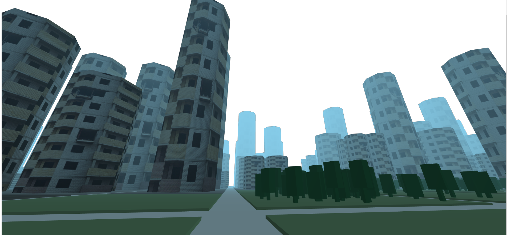
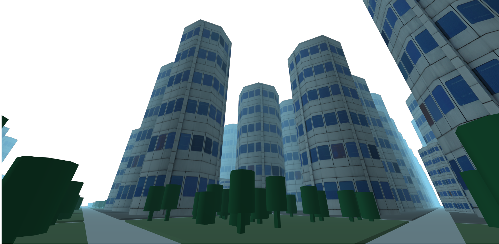
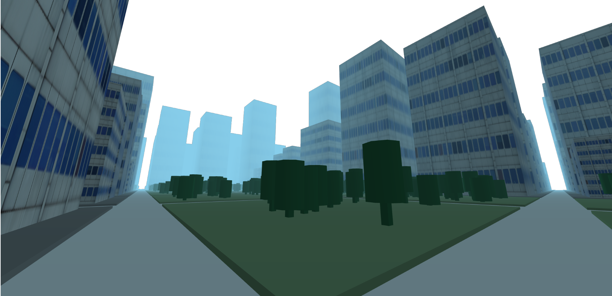
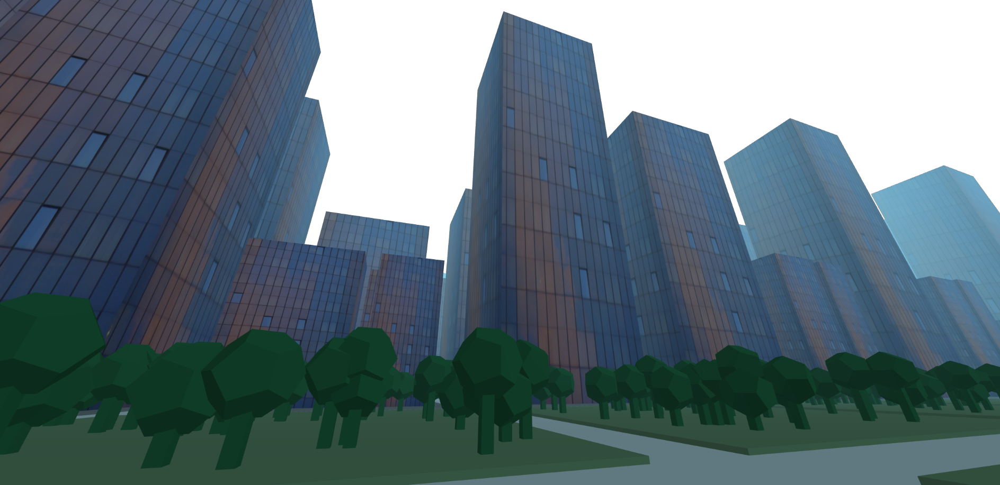
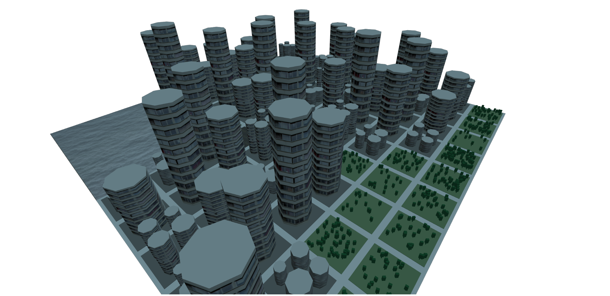
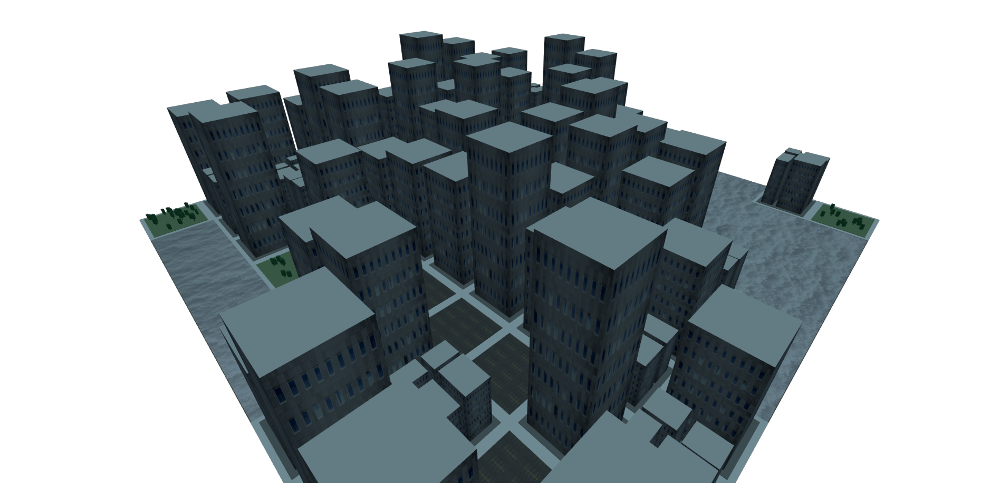
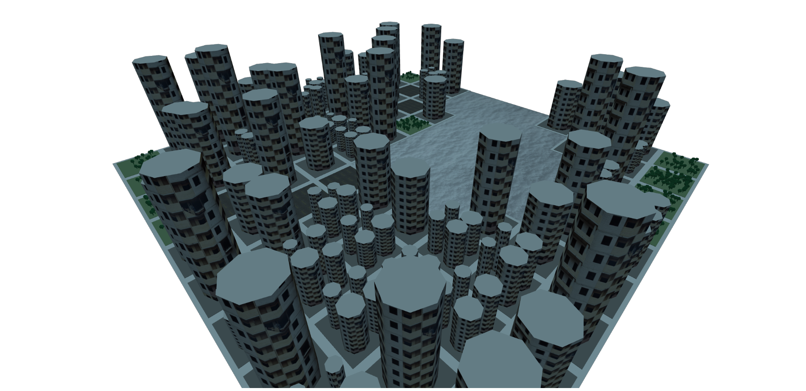
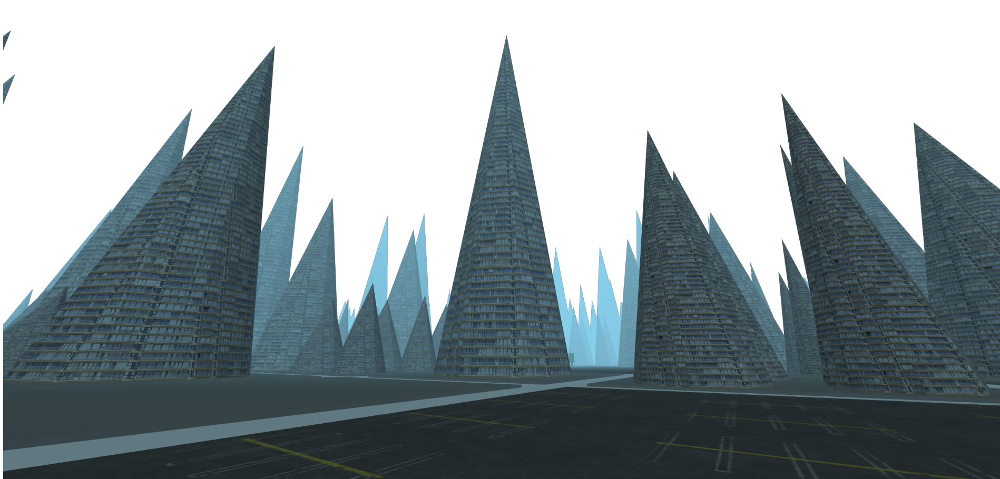
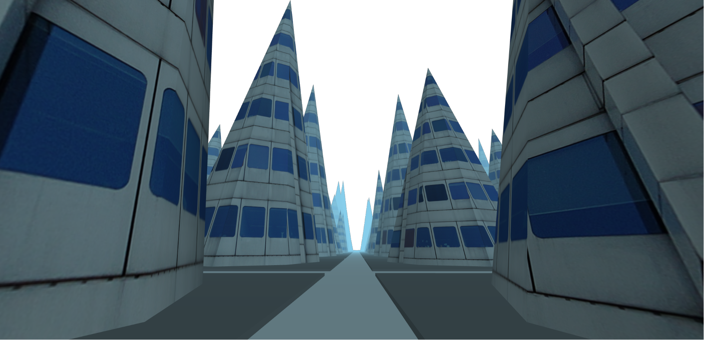
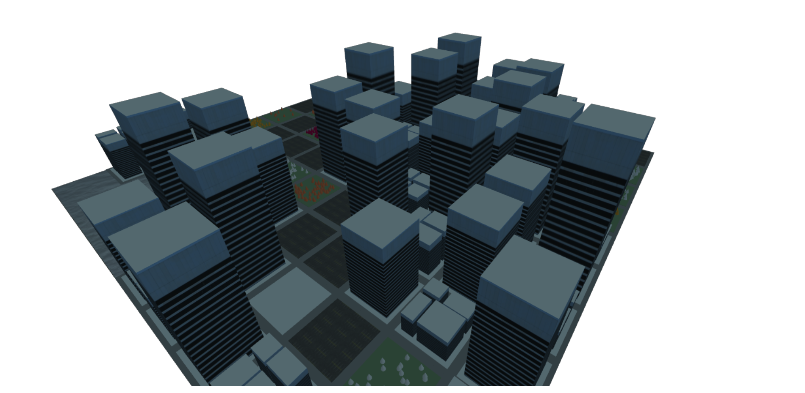
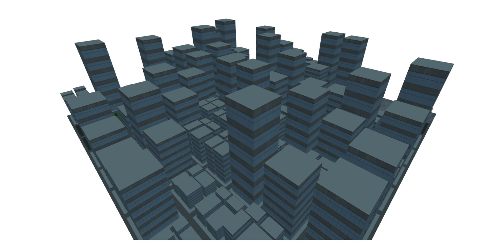
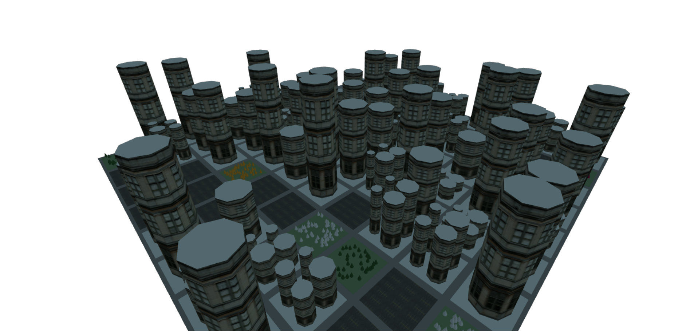
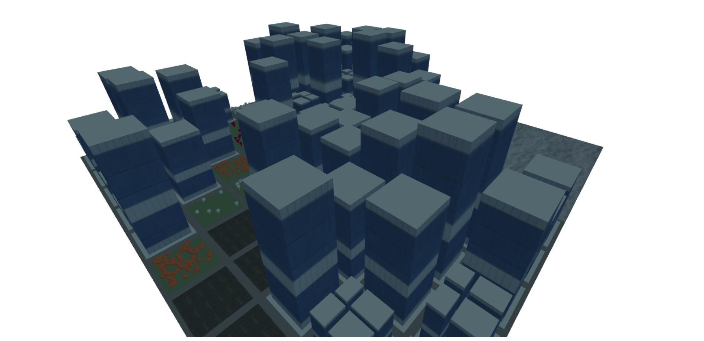
